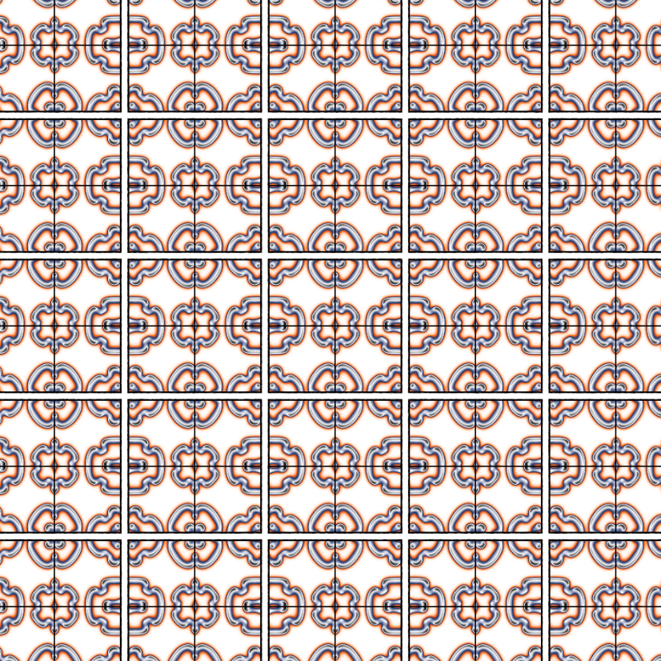
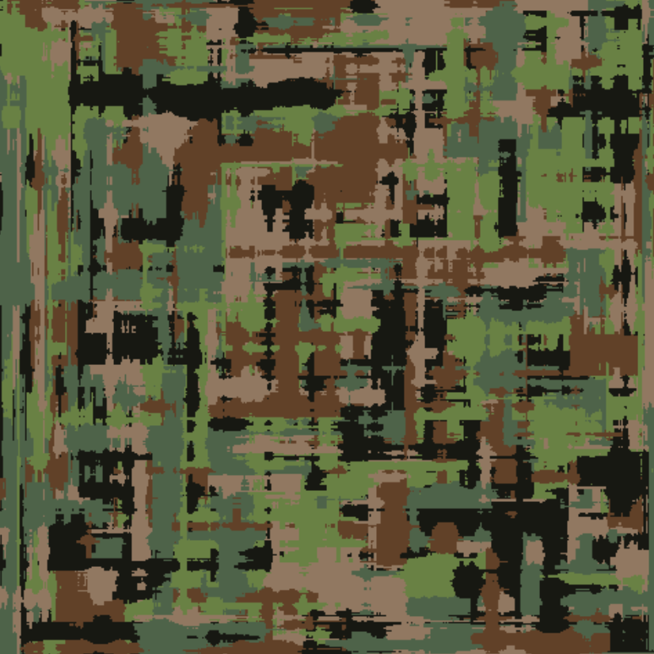
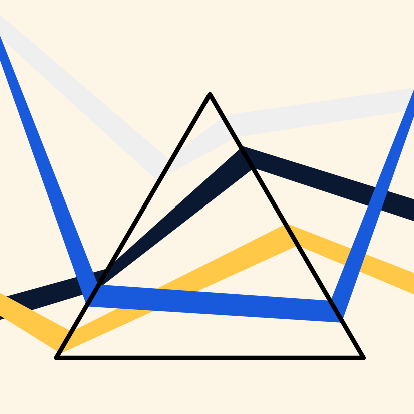
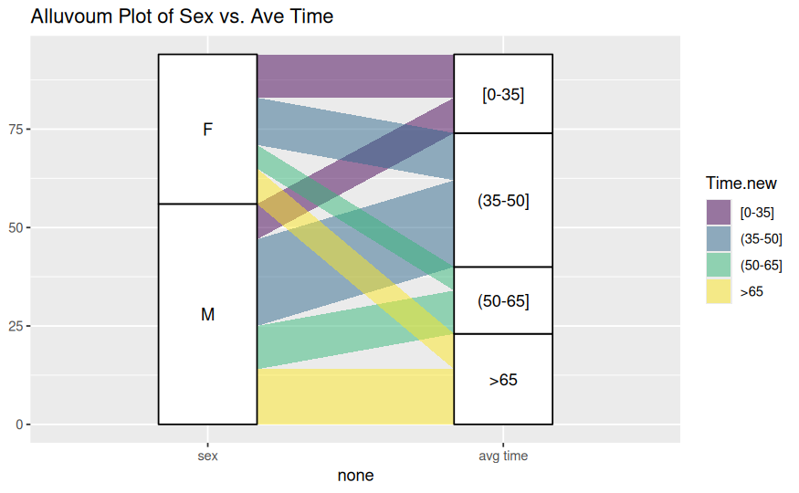
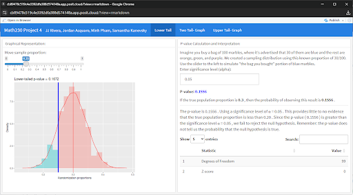
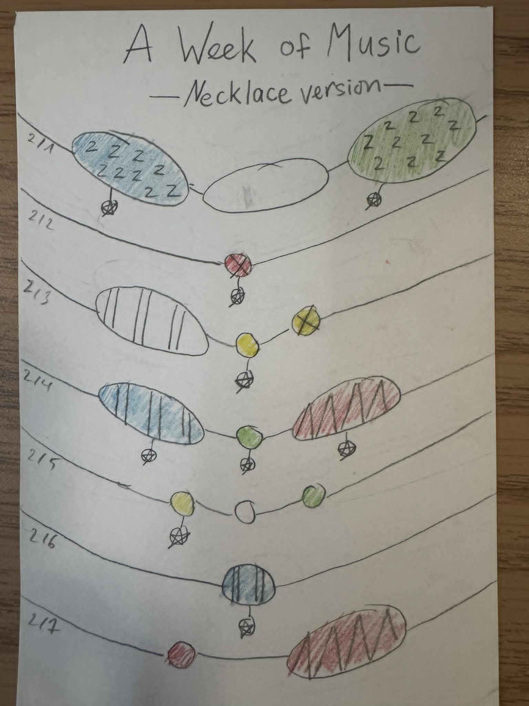
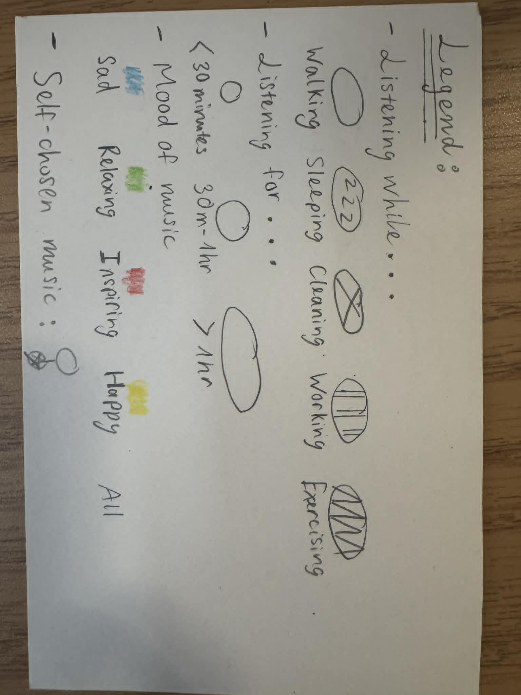
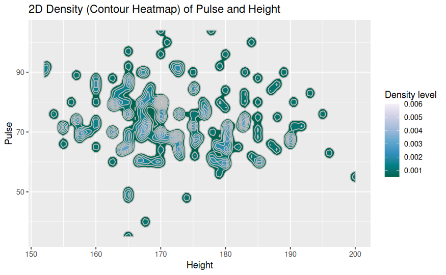

```{r setup, include=FALSE}
knitr::opts_chunk$set(echo = FALSE)
```


## Generative Art Project
::: columns
::: column
```{r}

```
**Title:** *Artwork 1*
:::

::: column
```{r}

```
**Title:** *Artwork 2*
:::

::: column
```{r}

```
**Title:** *Artwork 3*

:::
:::

## ggplot() Extenstion Project

```{r}

```

**Title:** *Alluvial Plot of Sex vs. Average Time*

**Dataset and variables:**  
This visualization uses the `Ninja` dataset. The main variables are `Sex`, which groups observations by sex, and `Time.new`, which represents average time categories.

**What the visualization shows:**  
This alluvial plot shows how observations flow from sex categories into average time categories. The widths of the flows represent how many observations fall into each combination of `Sex` and `Time.new`.

## Introductory Statistics Visualization

```{r, out.width="100%"}

```

**Title:** *Lower-Tailed Randomization Test for Population Proportion*

**Dataset and variables:**  
This visualization is based on a simulated randomization distribution generated using a binomial model with sample size \( n = 100 \) and null proportion \( p_0 = 0.30 \). The key variable is the sample proportion (`randomization.proportion`), with a user-controlled observed proportion (`xbar`) adjusted via a slider.

**What the visualization shows:**  
This plot displays the sampling distribution of proportions under the null hypothesis. The shaded region to the left of the observed sample proportion represents the lower-tail p-value—the probability of obtaining a sample proportion as small or smaller than the observed value if the true proportion is 0.30. This helps assess whether there is evidence that the true population proportion is less than the hypothesized value. 

## Dear Data Postcard


**Title:** *A Week of Music: Necklace Visualization*

::: columns
::: column
```{r}

```
:::

::: column
```{r}

```
:::
:::
**Dataset and variables:**  
This hand-drawn visualization represents a week of self-recorded music listening data. Each “necklace” corresponds to a day of the week, with visual encodings showing different attributes of listening behavior. Color represents mood (e.g., sad, relaxing, inspiring, happy), while shapes and patterns indicate activities (such as walking, sleeping, cleaning, working, or exercising) and duration of listening time.

**What the visualization shows:**  
This piece transforms daily music habits into a creative, wearable-style design. It shows how listening patterns vary across days, highlighting shifts in mood, activity, and time spent listening. The necklace format emphasizes continuity over time, making the data feel personal and expressive rather than purely analytical.

## Another Visualization from the Course

```{r}

```


**Title:** *2D Density (Contour Heatmap) of Pulse and Height*

**Dataset and variables:**  
This visualization uses the `survey` dataset. The two main variables are `Height`, representing individuals’ heights, and `Pulse`, representing their pulse rates. These continuous variables are used to explore the joint distribution of height and pulse.

**What the visualization shows:**  
This contour heatmap displays the density of observations across combinations of height and pulse. Areas with darker shading and tighter contour lines indicate regions where data points are more concentrated. The plot helps reveal where most individuals fall in terms of height and pulse, and whether any patterns or relationships exist between the two variables.