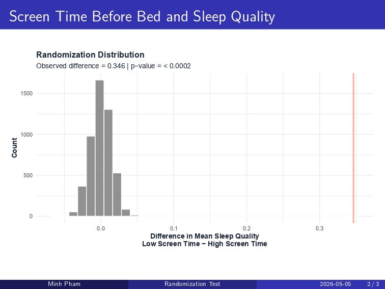
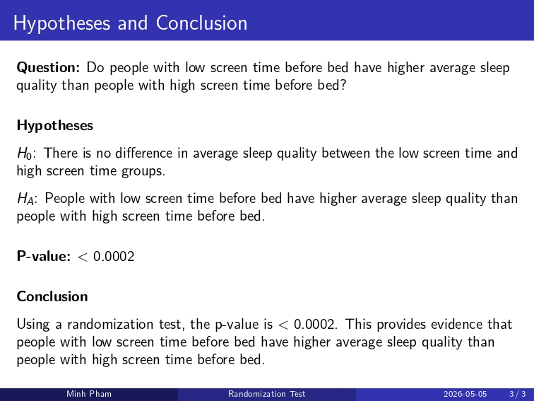

```{r setup, include=FALSE}
library(tidyverse)
library(ggplot2)
library(knitr)

sleep <- read.csv("sleep_health_dataset.csv")

sleep_palette <- c(
  "night_blue" = "#1B263B",
  "soft_blue" = "#778DA9",
  "moon" = "#E0E1DD",
  "lavender" = "#CDB4DB",
  "coral" = "#FFB4A2"
)

sleep <- sleep %>%
  mutate(
    exercise_day = factor(exercise_day, labels = c("No Exercise", "Exercise")),
    felt_rested = factor(felt_rested, labels = c("Did Not Feel Rested", "Felt Rested")),
    sleep_aid_used = factor(sleep_aid_used, labels = c("No Sleep Aid", "Used Sleep Aid")),
    shift_work = factor(shift_work, labels = c("No Shift Work", "Shift Work"))
  )

theme_sleep <- function() {
  theme_minimal() +
    theme(
      plot.title = element_text(
        face = "bold",
        color = sleep_palette["night_blue"],
        size = 15
      ),
      axis.title = element_text(
        color = sleep_palette["night_blue"],
        face = "bold"
      ),
      axis.text = element_text(
        color = sleep_palette["night_blue"]
      ),
      panel.grid.minor = element_blank(),
      panel.grid.major = element_line(color = "gray90"),
      legend.title = element_text(
        color = sleep_palette["night_blue"],
        face = "bold"
      ),
      legend.text = element_text(
        color = sleep_palette["night_blue"]
      )
    )
}
```

# The Architecture of Sleep

## Introduction

Sleep is something every person experiences, but it is shaped by many parts of daily life. This virtual art exhibit explores how sleep connects to habits, work routines, stimulant use, health risk, and cognitive performance. Rather than treating sleep as only a number of hours, this exhibit looks at sleep as part of a larger system of behavior and well-being. The visualizations ask how long people sleep, how well they sleep, and what daily factors may be connected to those outcomes. By moving through the exhibit, viewers can see how sleep changes from a simple personal habit into a broader story about modern life.

This exhibit uses the *Sleep Health and Daily Performance Dataset* from Kaggle. The dataset contains 100,000 observations and 32 variables related to sleep behavior, health, lifestyle habits, and cognitive performance. Each observation represents one record of a person’s sleep-related behavior and daily performance. The main variables I focus on are `sleep_duration_hrs`, `sleep_quality_score`, `work_hours_that_day`, `screen_time_before_bed_mins`, `caffeine_mg_before_bed`, `sleep_aid_used`, `sleep_disorder_risk`, `felt_rested`, and `cognitive_performance_score`. These variables were chosen because they allow the exhibit to move from basic sleep patterns to daily habits, bedtime behaviors, health risk, and performance outcomes.

The story begins with a summary of the dataset and the main sleep variables. It then explores how daily habits such as work hours and screen time relate to sleep. Next, it considers caffeine and sleep aid use as behaviors that may directly affect rest or reflect attempts to manage poor sleep. Finally, the exhibit connects sleep quality and sleep duration to health risk and cognitive performance. Together, these sections create a complete data story about how sleep is shaped by daily life.

## Color Palette

For this exhibit, I created a night-inspired color palette to match the theme of sleep and daily performance. The palette uses deep blue to represent nighttime and rest, soft blue and lavender to create a calm atmosphere, moonlight gray for contrast, and coral as an accent color for important trends or comparisons.

Using the same palette across the exhibit helps the visualizations feel connected as one cohesive virtual art exhibit.

```{r, echo=FALSE}
palette_preview <- tibble(
  Color = names(sleep_palette),
  Hex = sleep_palette
)

ggplot(palette_preview, aes(x = Color, y = 1, fill = Color)) +
  geom_tile(color = "white", linewidth = 1.5) +
  scale_fill_manual(values = sleep_palette) +
  geom_text(aes(label = Hex), color = "white", fontface = "bold", size = 4) +
  labs(
    title = "Color Palette for the Exhibit",
    x = NULL,
    y = NULL
  ) +
  theme_void() +
  theme(
    plot.title = element_text(
      face = "bold",
      color = sleep_palette["night_blue"],
      size = 15
    ),
    legend.position = "none"
  )
```

---

## Part 1: Understanding the Dataset

The first step in telling the story of sleep is understanding the overall shape of the data. Before comparing habits or outcomes, it is important to summarize the main variables and look at the basic distributions of sleep duration and sleep quality. These opening visualizations act as the entrance to the exhibit. They introduce the central sleep measurements that will appear throughout the rest of the page. This section helps viewers understand what the dataset looks like before the story moves into relationships between variables.

---

## Visualization 1: Summary Table

```{r, echo=FALSE}
summary_table <- sleep %>%
  summarize(
    `Observations` = n(),
    `Average Sleep Duration (hrs)` = round(mean(sleep_duration_hrs, na.rm = TRUE), 2),
    `Average Sleep Quality` = round(mean(sleep_quality_score, na.rm = TRUE), 2),
    `Average Work Hours` = round(mean(work_hours_that_day, na.rm = TRUE), 2),
    `Average Screen Time Before Bed (mins)` = round(mean(screen_time_before_bed_mins, na.rm = TRUE), 2),
    `Average Caffeine Before Bed (mg)` = round(mean(caffeine_mg_before_bed, na.rm = TRUE), 2),
    `Average Cognitive Performance` = round(mean(cognitive_performance_score, na.rm = TRUE), 2)
  )

kable(summary_table, caption = "Summary of key variables used in the sleep exhibit")
```

**Title:** *A Snapshot of the Sleep Dataset*  

**Dataset and variables:**  
This table summarizes the main variables used throughout the exhibit, including sleep duration, sleep quality, work hours, screen time before bed, caffeine before bed, and cognitive performance.

**What the visualization shows:**  
The table gives viewers a quick overview of the dataset before they begin looking at individual graphs. It establishes the scale of the data and introduces the variables that guide the rest of the story.

---

## Visualization 2

```{r, out.width="80%"}
ggplot(sleep, aes(x = sleep_duration_hrs)) +
  geom_histogram(
    fill = sleep_palette["soft_blue"],
    color = "white",
    bins = 30
  ) +
  labs(
    title = "Distribution of Sleep Duration",
    x = "Sleep Duration (hours)",
    y = "Count"
  ) +
  theme_sleep()
```

**Title:** *Distribution of Sleep Duration*  

**Dataset and variables:**  
This visualization uses `sleep_duration_hrs`, which measures the number of hours individuals slept.

**What the visualization shows:**  
This histogram shows how sleep duration is distributed across the dataset. It helps identify the most common sleep lengths and gives viewers a baseline understanding of typical sleep patterns.

---

## Visualization 3

```{r, out.width="80%"}
ggplot(sleep, aes(x = sleep_quality_score)) +
  geom_histogram(
    fill = sleep_palette["lavender"],
    color = "white",
    bins = 30
  ) +
  labs(
    title = "Distribution of Sleep Quality Scores",
    x = "Sleep Quality Score",
    y = "Count"
  ) +
  theme_sleep()
```

**Title:** *Distribution of Sleep Quality*  

**Dataset and variables:**  
This visualization uses `sleep_quality_score`, which measures reported sleep quality.

**What the visualization shows:**  
This histogram shows how sleep quality scores are distributed across individuals. It helps establish how people generally rate their sleep before the exhibit moves into possible influences on sleep quality.

---

## Part 2: Daily Habits and Sleep Quality

After introducing the main sleep variables, the next part of the exhibit explores how daily habits relate to sleep. Sleep is not separate from the rest of the day; it can be shaped by work demands, routines, technology use, and the amount of time people have available for rest. This section begins with sleep duration and sleep quality, then moves backward into possible daily influences. Work hours represent the structure of the day, while screen time before bed represents a behavior that happens closer to sleep. Together, these visualizations show how both daytime responsibilities and bedtime routines may shape rest.

---

## Visualization 4

```{r, out.width="80%"}
ggplot(sleep, aes(x = sleep_duration_hrs, y = sleep_quality_score)) +
  geom_point(
    alpha = 0.10,
    color = sleep_palette["soft_blue"]
  ) +
  geom_smooth(
    color = sleep_palette["coral"],
    se = FALSE,
    linewidth = 1.2
  ) +
  labs(
    title = "Sleep Duration and Sleep Quality",
    x = "Sleep Duration (hours)",
    y = "Sleep Quality Score"
  ) +
  theme_sleep()
```

**Title:** *Sleep Duration and Sleep Quality*  

**Dataset and variables:**  
This visualization uses `sleep_duration_hrs` and `sleep_quality_score`.

**What the visualization shows:**  
This plot shows whether people who sleep longer tend to report higher sleep quality. The trend line helps summarize the overall relationship between sleep quantity and sleep experience.

---

## Visualization 5

```{r, out.width="80%"}
ggplot(sleep, aes(x = work_hours_that_day, y = sleep_duration_hrs)) +
  geom_point(
    alpha = 0.08,
    color = sleep_palette["lavender"]
  ) +
  geom_smooth(
    color = sleep_palette["night_blue"],
    se = FALSE,
    linewidth = 1.2
  ) +
  labs(
    title = "Work Hours and Sleep Duration",
    x = "Work Hours That Day",
    y = "Sleep Duration (hours)"
  ) +
  theme_sleep()
```

**Title:** *Work Hours and Sleep Duration*  

**Dataset and variables:**  
This visualization uses `work_hours_that_day` and `sleep_duration_hrs`.

**What the visualization shows:**  
This plot explores how the number of hours worked in a day relates to sleep duration. It helps show whether heavier work demands may be connected to getting less sleep.

---

## Visualization 6: Peer Review Addition

```{r, out.width="80%"}
ggplot(sleep, aes(x = screen_time_before_bed_mins, y = sleep_quality_score)) +
  geom_point(
    alpha = 0.08,
    color = sleep_palette["lavender"]
  ) +
  geom_smooth(
    color = sleep_palette["coral"],
    se = FALSE,
    linewidth = 1.2
  ) +
  labs(
    title = "Screen Time Before Bed and Sleep Quality",
    x = "Screen Time Before Bed (minutes)",
    y = "Sleep Quality Score"
  ) +
  theme_sleep()
```

**Title:** *The Glow Before Sleep*  

**Dataset and variables:**  
This visualization uses `screen_time_before_bed_mins` and `sleep_quality_score`. Screen time before bed measures how many minutes an individual used a screen before sleeping, while sleep quality score measures the reported quality of sleep.

**What the visualization shows:**  
This plot explores whether more screen time before bed is associated with lower sleep quality. This visualization was added after peer review to create a smoother transition between daily habits and bedtime behaviors.

---

## Part 3: Stimulants, Sleep Aids, and Sleep Quality

After looking at daily habits and bedtime screen use, the third section focuses on behaviors that may directly affect sleep or reflect attempts to manage sleep problems. Caffeine before bed and sleep aid use are important because they represent choices people make near sleep time. Caffeine is a stimulant, so it may interfere with sleep quality when consumed close to bedtime. Sleep aid use is more complicated because it may represent an attempt to fix poor sleep rather than a direct cause of better or worse sleep. This section shows that sleep-related behaviors are not always simple and often require careful interpretation.

---

## Visualization 7

```{r, out.width="80%"}
ggplot(sleep, aes(x = caffeine_mg_before_bed, y = sleep_quality_score)) +
  geom_point(
    alpha = 0.08,
    color = sleep_palette["soft_blue"]
  ) +
  geom_smooth(
    color = sleep_palette["coral"],
    se = FALSE,
    linewidth = 1.2
  ) +
  labs(
    title = "Caffeine Before Bed and Sleep Quality",
    x = "Caffeine Before Bed (mg)",
    y = "Sleep Quality Score"
  ) +
  theme_sleep()
```

**Title:** *Caffeine and Sleep Quality*  

**Dataset and variables:**  
This visualization uses `caffeine_mg_before_bed` and `sleep_quality_score`.

**What the visualization shows:**  
This plot shows how caffeine intake before bed relates to sleep quality. It helps reveal whether higher caffeine consumption near bedtime is associated with poorer sleep.

---

## Visualization 8

```{r, out.width="70%"}
ggplot(sleep, aes(x = sleep_aid_used, y = sleep_quality_score, fill = sleep_aid_used)) +
  geom_boxplot(
    alpha = 0.85,
    color = sleep_palette["night_blue"]
  ) +
  scale_fill_manual(
    values = c(
      "No Sleep Aid" = sleep_palette["soft_blue"],
      "Used Sleep Aid" = sleep_palette["coral"]
    )
  ) +
  labs(
    title = "Sleep Aid Use and Sleep Quality",
    x = "Sleep Aid Use",
    y = "Sleep Quality Score"
  ) +
  theme_sleep() +
  theme(legend.position = "none")
```

**Title:** *Sleep Aids and Sleep Quality*  

**Dataset and variables:**  
This visualization uses `sleep_aid_used` and `sleep_quality_score`.

**What the visualization shows:**  
This boxplot compares sleep quality between individuals who used sleep aids and those who did not. It raises the question of whether sleep aids are linked to better sleep or whether they are more common among people already experiencing sleep difficulties.

---

## Part 4: Sleep, Health Risk, and Performance

The final section connects sleep to broader outcomes. After looking at habits and sleep-related behaviors, the exhibit ends by asking what sleep may mean for health risk and daily functioning. Sleep disorder risk connects individual sleep quality to a larger health concern. Cognitive performance connects rest to how people function after waking. Together, these visualizations show that sleep quality is not just about comfort; it may also reflect broader patterns in well-being and performance.

---

## Visualization 9

```{r, out.width="75%"}
ggplot(sleep, aes(x = sleep_disorder_risk, y = sleep_quality_score, fill = sleep_disorder_risk)) +
  geom_boxplot(
    alpha = 0.85,
    color = sleep_palette["night_blue"]
  ) +
  scale_fill_manual(
    values = c(
      "Healthy" = sleep_palette["soft_blue"],
      "Low" = sleep_palette["moon"],
      "Moderate" = sleep_palette["lavender"],
      "High" = sleep_palette["coral"]
    )
  ) +
  labs(
    title = "Sleep Disorder Risk and Sleep Quality",
    x = "Sleep Disorder Risk",
    y = "Sleep Quality Score"
  ) +
  theme_sleep() +
  theme(legend.position = "none")
```

**Title:** *Sleep Disorder Risk and Sleep Quality*  

**Dataset and variables:**  
This visualization uses `sleep_disorder_risk` and `sleep_quality_score`.

**What the visualization shows:**  
This boxplot shows how sleep quality differs across levels of sleep disorder risk. It helps connect individual sleep experiences to broader health-related concerns.

---

## Visualization 10: New Visualization Type

```{r, out.width="80%"}
ggplot(sleep, aes(x = sleep_duration_hrs, y = cognitive_performance_score)) +
  stat_density_2d(
    aes(fill = after_stat(level)),
    geom = "polygon",
    color = "white"
  ) +
  scale_fill_gradient(
    low = sleep_palette["moon"],
    high = sleep_palette["night_blue"]
  ) +
  labs(
    title = "Sleep Duration and Cognitive Performance",
    x = "Sleep Duration (hours)",
    y = "Cognitive Performance Score",
    fill = "Density"
  ) +
  theme_sleep()
```

**Title:** *Sleep and Performance*  

**Dataset and variables:**  
This visualization uses `sleep_duration_hrs` and `cognitive_performance_score`.

**What the visualization shows:**  
This contour density plot shows where combinations of sleep duration and cognitive performance are most concentrated. It is included as a new visualization type because it displays the concentration of two continuous variables at the same time, helping reveal patterns that would be harder to see in a crowded scatterplot.

---

## Nonparametric Inference: Screen Time Before Bed and Sleep Quality

The visual story so far suggests that bedtime habits may be related to sleep quality. To investigate this more formally, I used a randomization test comparing average sleep quality between people with low screen time before bed and people with high screen time before bed.

This test fits the exhibit because screen time before bed acts as a bridge between daily habits and sleep outcomes. Instead of assuming a traditional parametric model, the randomization test creates a distribution of differences that could happen by chance if there were no real difference between the two screen-time groups.

```{r, echo=FALSE, out.width="85%"}

```

```{r, echo=FALSE, out.width="85%"}

```

**Title:** *Randomization Test: Screen Time Before Bed and Sleep Quality*  

**Dataset and variables:**  
This inference uses `screen_time_before_bed_mins` and `sleep_quality_score`. Screen time before bed was divided into two groups: low screen time and high screen time. The response variable is average sleep quality score.

**What the inference shows:**  
The randomization distribution shows what differences in average sleep quality would look like if screen time group and sleep quality were not meaningfully related. The observed difference was 0.346, meaning the low screen time group had a higher average sleep quality score than the high screen time group. The p-value was less than 0.0002, providing evidence that people with low screen time before bed have higher average sleep quality than people with high screen time before bed.

This inference strengthens the exhibit’s main story by showing that bedtime screen use is not only visually associated with sleep quality, but also statistically meaningful in this dataset.

---

## Conclusion

Together, these visualizations show that sleep is connected to many parts of daily life. The exhibit begins by summarizing sleep duration and sleep quality, then explores how work habits, screen time, caffeine, and sleep aid use relate to sleep outcomes. Finally, it connects sleep to health risk and cognitive performance.

While these visualizations do not prove causation, they reveal meaningful patterns that can guide deeper statistical analysis. Overall, the exhibit suggests that sleep is not an isolated behavior. It is shaped by daily routines, lifestyle choices, health risk, and how people function after waking. By presenting the data as a visual exhibit, this page shows how statistics and design can work together to tell a clearer story about everyday life.